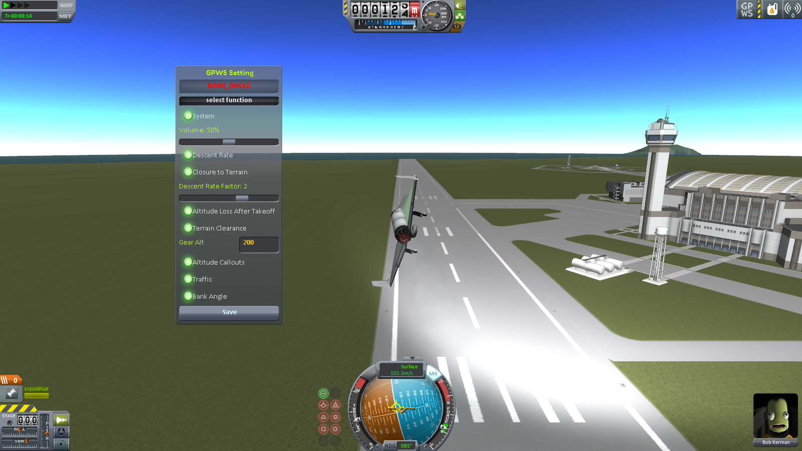

# GPWS /L Unofficial

This mod adds warning sounds for KSP. GPWS means "ground proximity warning system", a terrain awareness and alerting system. I also add TCAS ("traffic collision avoidance system") warning.

Unofficial fork by Lisias.

## In a Hurry

* [Latest Release](https://github.com/net-lisias-kspu/GPWS/releases)
	+ [Binaries](https://github.com/net-lisias-kspu/GPWS/tree/Archive)
* [Source](https://github.com/net-lisias-kspu/GPWS)
* Documentation
	+ [Project's README](https://github.com/net-lisias-kspu/GPWS/blob/master/README.md)
	+ [Install Instructions](https://github.com/net-lisias-kspu/GPWS/blob/master/INSTALL.md)
	+ [Change Log](./CHANGE_LOG.md)
	+ [TODO](./TODO.md) list

## Description

Just like commercial airliners your spaceplanes will have GPWS installed in your landing gear! Yes, you heard right: right into your landing gear!

This mod basically adds GPWS and uses the default landing gear. This will add a couple of warning sounds if you are losing altitude rapidly and have a chance to crash into the terrain. The warning sound is probably something you are familiar with! `"WHOOP WHOOP PULL UP!!"`. Mod will also announce altitudes during a landing starting from 1000 to 10 meters.

GPWS means "ground proximity warning system", a terrain awareness and alerting system. The mod also adds TCAS ("traffic collision avoidance system") warning.

* References:
	+ [Mk_V_VII_EGPWS.pdf](./Docs/Mk_V_VII_EGPWS.pdf)
		- Original [link](http://www51.honeywell.com/aero/common/documents/Mk_V_VII_EGPWS.pdf), broken.
	- [Ground Proximity Warning System
(GPWS)](http://www.boeing-727.com/Data/systems/infogpws.html)

### How to Use

Fly an aircraft with landing gear(s).
(It should have a ModuleWheelDeployment && ModuleWheelBrakes, or FSwheel module.)
If you enabled system in GPWS Settings,
You should hear sounds when you are landing/crashing.

You can edit GPWS.cfg to add more types of landing gear.

This mod adds a button on blizzy78's toolbar / applaunch toolbar.
Click it to open GUI to edit settings or view current warning status.
You are free to turn off warnings you don't want to hear.

You can edit settings.cfg for more accurate adjustment.

P.S.1. This mod uses feet for plane altitude.

P.S.2. Change "Descent Rate Factor" to allow faster/slower sink rate. (Set to 2 means you are allowed to sink 2 times faster than default.)

### Supported Warning List

#### Plane
- sink rate
- sink rate, whoop whoop pull up
- terrain terrain
- terrain terrain, whoop whoop pull up
- don't sink
- too low gear
- too low terrain
- bank angle
- altitude callout (1000, 500, approaching minimus, minimus, 100, 50, 40, 30, 20, 10)
- retard
- traffic
- rotate
- (stall) (joystick vibration tested on x1 controller)

#### Lander
- sink rate
- horizontal speed
- altitude callout (1000, 500, 100, 50, 40, 30, 20, 10)
- retard

## Installation

Detailed installation instructions are now on its own file (see the [In a Hurry](#in-a-hurry) section) and on the distribution file.

## License:

This work is licensed under a Creative Commons Attribution-NonCommercial-ShareAlike 4.0 International License. (CC-NC-SA 4)

Please note the copyrights and trademarks in [NOTICE](./NOTICE).

## UPSTREAM

* [Cryphonus](https://forum.kerbalspaceprogram.com/index.php?/profile/23502-cryphonus/) ROOT
	+ [Forum](https://forum.kerbalspaceprogram.com/index.php?/topic/39704-*)
* [bssthu](https://forum.kerbalspaceprogram.com/index.php?/profile/139023-bssthu/) CURRENT
	+ [Github](https://github.com/bssthu/KSP_GPWS)
